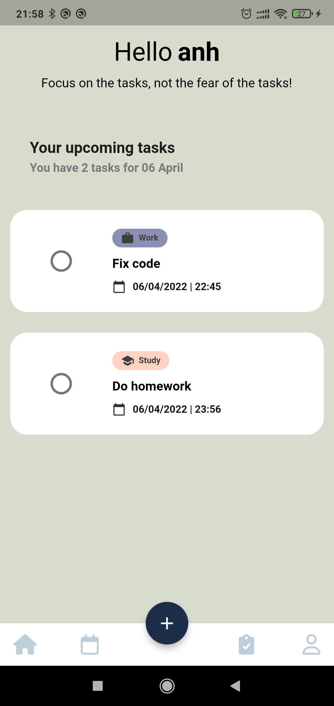
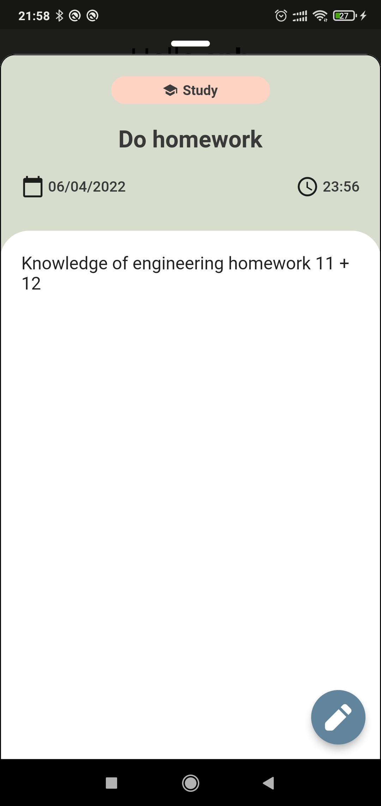
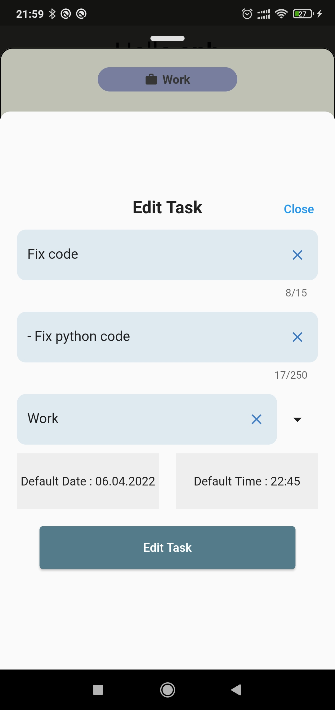
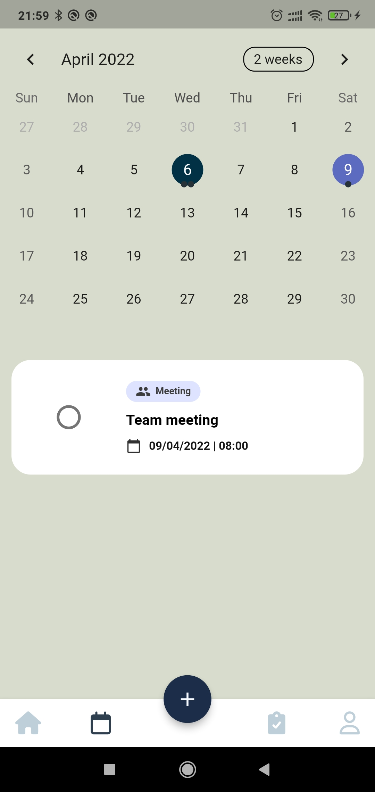
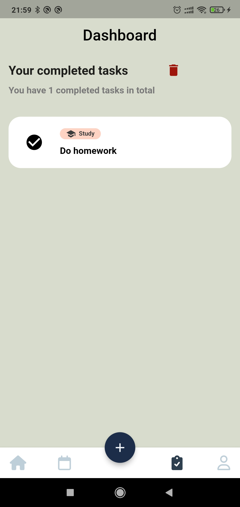
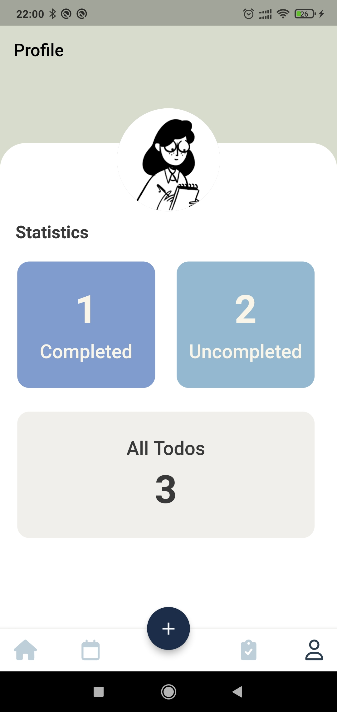

# Mobile and Multimedia System Lab 2 - Task Manager Application

 &nbsp;  &nbsp;  &nbsp;  &nbsp;
 &nbsp;
 

Feature:

- Add new task: title, description, categories (Work, Study, Meeting, Call, Uncategorized)
- See list upcoming task for today, for other days (calendar page)
- See details about task by tapping on each task
- Edit task's information
- Swipe left (mark finished task), right (remove task)
- See list of finished tasks on Dashboard 
- On Dashboard: remove finished tasks permanently by swiping right or tap on remove icon, swipe left to uncomplete task
- See statistics about all tasks to do, completed tasks, uncompleted tasks